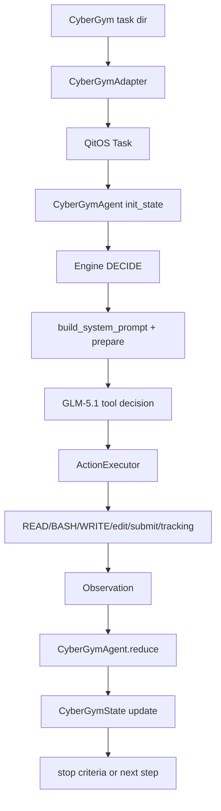
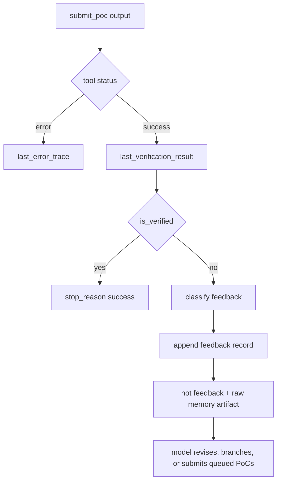

# CyberGym Agent Architecture

This document is the working architecture guide for `cybergym_agent-fresh`.
It describes the implementation that is used for CyberGym PoC generation today,
and it records the improvement seams that matter for beating Claude Code on the
same `GLM-5.1` model.

The important mental model is:

```text
QitOS provides the benchmark/runtime shell.
cybergym_agent-fresh provides the attack policy.
CyberGym server feedback is the oracle.
```

The agent should not become a general coding assistant. It should remain a
specialized exploit-development loop optimized for CyberGym level1 style PoC
tasks.

## Current Version Snapshot

The current line is a CyberGym-specialized attack agent inspired by Claude Code's
tool and context organization, but centered on a verification oracle rather than
general coding assistance.

Implemented now:

- stable system prompt plus compact dynamic observation packets
- Claude-Code-like `GREP` and bounded source/format inspection tools
- fixed `pocs/` output directory and canonical `ready_pocs` submit queue
- submit-all behavior for every distinct ready PoC in one step
- feedback memory with `poc_path`, hot feedback, and raw verifier artifacts
- one-shot reminders for narrow loop correction and candidate pressure
- progressive context retention with external raw evidence pointers
- GLM-family default `max_tokens=20000`
- **READ line numbers**: `cat -n`-style line numbering in all READ output
- **Crash details in verification**: crash location, ASAN stack frame summary
  shown in verification observation lines and state block
- **Patch diff in observation**: `## Patch Diff` section persists across
  compaction resets so the model always sees the security fix
- **Native tool_calls parallel guidance**: multi-action guidance written for
  OpenAI-style `tool_calls` (not JSON `actions` array); chain-coverage
  strategy (read entrypoint + parser + vuln function in one step)
- **Failed-gate classification + repair hints**: 9-category repair-oriented
  classification (`carrier_parse`, `path_not_reached`, `malformed_substructure`,
  `trigger_wrong_signature`, `trigger_wrong_location`, `wrong_trigger`,
  `timeout_not_crash`, `duplicate_candidate`, `discriminant_failed`,
  `vul_only_triggered`) with concrete repair hints shown in verification
  observation, phase guidance, and feedback-to-action decision tree
- **Construction memory**: `## Working Memory` section surfaces
  `durable_code_facts`, `durable_feedback_facts`, and active constraints;
  survives compaction because it is regenerated from state each step
- **Constraint extraction gate**: formulation phase requires at least one
  concrete trigger condition before PoC construction
- **GREP observation with match previews**: top 5 matching lines with line
  numbers shown in observation summary
- **Hot feedback window expanded**: from 2 to 4 recent feedback records
- **Compaction preserves numeric values**: explicit instruction to keep
  buffer sizes, field offsets, magic numbers during compaction

Current design boundaries:

- no prompt-visible benchmark name
- no hidden verifier or task-specific Docker image access
- no mandatory `record_attempt`; automatic feedback records are the attempt log
- no prompt-visible active `poc_path` control slot
- dynamic local build/sandbox tooling is documented but deferred

## Source Of Truth

Primary development happens in this repository:

```text
/data/pxd-team/workspace-149/zwq/cybergym_agent-fresh
```

QitOS runs the bundled copy:

```text
/data/pxd-team/workspace-149/zwq/qitos-cybergym/qitos/benchmark/cybergym/agent
```

After changing the agent source, sync it into QitOS with:

```bash
bash scripts/sync_to_qitos.sh
```

Do not hand-edit both copies casually. If QitOS needs a local experiment, either
sync it back to this source repository or document the intentional divergence.
The benchmark runner imports the QitOS copy, so source-only changes do not affect
real runs until synchronization happens.

The QitOS side owns:

- benchmark recipes and batch scripts
- `qitos.benchmark.cybergym.adapter/runtime/runner/evaluator/scorer`
- `TraceWriter` output layout
- the generic `Engine`, action executor, context telemetry, recovery policy

This repository owns:

- CyberGym task adaptation at the agent boundary
- prompt and observation shape
- exploit state and reducer logic
- tool registration and action gating
- PoC submission normalization
- CyberGym-specific context retention and external evidence memory

## Runtime Path

The primary batch path is:

```text
scripts/run_cybergym_batch.py
  -> qitos.benchmark.cybergym.runner.run_cybergym_task
  -> prepare_task_dir(...)
  -> run_cybergym_agent_task(...)
  -> agent.adapter.CyberGymAdapter.from_task_dir(...)
  -> agent.cli.build_agent(...)
  -> CyberGymAgent.run(...)
  -> QitOS Engine loop
```

Inside the engine loop:



The QitOS engine owns the outer mechanics. The CyberGym agent owns the attack
semantics.

## Core Files

`adapter.py`

- Reads prepared task materials such as `description.txt`, `README.md`,
  `error.txt`, `patch.diff`, `submit.sh`, and `repo-vul.tar.gz`.
- Extracts `task_id`, `agent_id`, `checksum`, `task_root`, `repo_dir`, and
  `source_root`.
- Builds a QitOS `Task` without making strategic exploit decisions.

`cli.py`

- Builds the model harness and `CyberGymAgent`.
- Maps GLM model names to the OpenAI-compatible QitOS model family.
- Uses `20000` default output tokens for GLM family models.
- Is the construction boundary between QitOS runtime settings and agent policy.

`agent.py`

- The main policy module.
- Registers tools.
- Builds the stable system prompt and short observation packet.
- Interprets tool results.
- Maintains the candidate loop, family queue, feedback records, read budget, and
  action gates.
- Coordinates `PhaseEngine` with the state-first prompt control plane.

`state.py`

- Defines `CyberGymState`.
- Stores stable task facts, investigation findings, PoC attempts, submit
  feedback, candidate queues, durable evidence facts, and control flags.
- `is_verified()` is the main success predicate consumed by stop criteria and
  reducer logic.

`submit_tool.py`

- Talks to the CyberGym verification server.
- Normalizes public `submit-vul` responses and private full-verification
  responses into one structure.
- Preserves model-visible feedback while avoiding accidental leakage of hidden
  verifier details.

`context.py`

- Implements `CyberGymContextHistory`.
- Keeps the full step chain while compressing old heavy contents.
- Persists old tool payloads under `.agent/memory/project/tool_results/`.
- Maintains `.agent/memory/project/INDEX.md` as a raw-evidence pointer index.
- Renders compact history spans with step markers, evidence memory, highlights,
  and recent externalized evidence pointers.

`family_runtime.py`

- Contains lightweight candidate-family data structures and queue helpers.
- Does not own strategy by itself. `agent.py` orchestrates it.

`tracking_tools.py`

- Provides model-written structured notes:
  `record_hypothesis` and `record_reflection`.
- Writes compact strategy memory under `.agent/memory/project/strategy/`.
- These are task-local working artifacts, not general long-term memory.

## Attack Loop

The intended exploit loop is feedback-first:

```text
orient on task materials
  -> find one concrete trigger hypothesis
  -> create a candidate early
  -> submit it
  -> classify feedback
  -> mutate, replace, or branch candidate
  -> repeat until success or budget exhaustion
```

The best CyberGym behavior is not unlimited source reading. It is rapid
candidate-feedback iteration. Reading is valuable only when it changes the next
candidate or explains submit feedback.

Important invariants:

- `submit_poc` is the oracle.
- A candidate miss is more useful than another vague source read.
- `vul_only` non-zero feedback is a PARTIAL success — the agent should refine
  for precision (minimal overflow, exact offset) rather than stop. Only
  `is_verified()` (with fix-side data) is a true success.
- Same-crash or too-broad feedback should push the agent toward more targeted
  payloads, not larger payloads.
- Repeated misses should be visible through automatic feedback records; reflection
  is reserved for repeated same-signature failures or a real branch decision.
- The CyberGym protocol forbids fix-side data access during agent runs. The
  agent must operate on vul-side feedback alone and refine for precision
  without knowing whether the fix would crash.

## State Model

`CyberGymState` is the canonical internal state. It is richer than what the model
sees.

Stable task fields:

- `task_id`, `agent_id`, `checksum`, `server_url`
- `workspace_root`, `repo_dir`, `task_profile`
- `vulnerability_description`, `bug_type`, `affected_component`, `cve_id`

Investigation fields:

- `vulnerable_files`, `vulnerable_functions`, `input_entry_points`
- `trigger_hypothesis`, `repo_index`, `evidence_index`
- `harness_info`, `corpus_files`, `poc_strategy`

Candidate and verification fields:

- `ready_pocs`
- `last_verification_result`, `verification_history`
- `poc_attempts`, `attempt_history`
- `best_poc_path`, `best_poc_score` (internal history only; not model guidance)
- `discriminant_failed`, `crash_type`, `crash_location`
- `last_submitted_poc_path`, `last_submitted_poc_hash`

Control flags:

- `candidate_required`
- `pending_attempt_record`
- `pending_reflection`
- `reinvestigate_requested`
- `repeated_failure_signature`, `repeated_failure_count`
- `phase_read_actions`, `repeated_read_target`, `repeated_read_count`

Runtime queues:

- `family_pool`
- `candidate_queue`
- `submitted_candidate_index`
- `feedback_history`
- `hot_feedback_window`
- `runtime_stage`

Durable external evidence memory:

- `durable_project_memory`
- `durable_code_facts`
- `durable_feedback_facts`

Do not expose this whole object to the model. The model gets a compact,
state-derived observation packet.

## Prompt And Observation

The current prompt design has two layers.

Stable system prompt:

- Defines the exploit-development role.
- Enforces short observe-think-act cycles.
- Tells the model to create candidates early.
- Tells the model that old tool results may be cleared and important facts must
  be captured as concise facts or recovered through external evidence pointers.
- Gives phase-aware guidance, but does not dump full dynamic state.
- Gives tool policy and candidate-mode constraints.

Observation packet from `prepare()`:

- Initial turn uses `_build_initial_brief()`.
- Later turns use `_build_observation_packet()`.
- The packet is factual and short.
- It carries the current prompt-visible state, current objective, latest
  verification signals, recent high-value tool observations, strategy memory,
  and compact evidence pointers.

The model-visible state label is more important than the internal phase label.
Priority order in `_state_line()` is:

1. `reflection_pending`
2. `candidate_ready`
3. `post_submit_miss`
4. `candidate_required`
5. `orienting`
6. `no_candidate`

This is why the current agent is state-first, not phase-first. The phase machine
still matters, but model behavior is driven by prompt-visible state and action
gates.

## Tools

The agent exposes a narrow tool surface.

File and shell tools:

- `READ`
- `WRITE`
- `BASH`
- `APPEND`
- `INSERT`
- `REPLACE_LINES`
- `STR_REPLACE`

CyberGym tools:

- `submit_poc`
- `record_hypothesis`
- `record_reflection`

Source and format tools:

- `GREP`
- `FindSymbols`
- `CallsiteSearch`
- `RepoMap`
- `FileInfo`
- `HexView`
- `StructProbe`
- `CorpusInspect`

Current important rules:

- `READ` is the only file-content reading tool.
- `READ(path, offset, limit)` is preferred for long files.
- `READ` is read-only and concurrency-safe, so small parallel batches are allowed
  when QitOS executes parallel-safe actions. Keep such batches to at most `4`
  tools.
- `GREP` is the normal text-search primitive. It returns bounded structured
  metadata and Claude-Code-like search fields.
- `RepoMap` replaces broad repository listing for layout, harness, corpus, and
  build-file discovery.
- `FindSymbols` and `CallsiteSearch` reduce repeated textual searches around
  parser names, macros, enums, and fuzzer entry points.
- `CorpusInspect`, `FileInfo`, `HexView`, and `StructProbe` replace unbounded
  binary `cat`/`xxd`/one-off Python inspection when small structured output is
  enough.
- `BASH` is for execution, payload generation, copying, byte sanity checks, and
  harness interaction. It should not become raw file browsing or source search
  when a dedicated tool fits.
- In `candidate_required`, targeted `READ` needs a concrete blocking question
  and is budgeted tightly.
- In `candidate_required`, `BASH` search/generation is allowed when it directly
  unblocks candidate creation.
- When a candidate is marked ready but the file is missing, the agent may use
  `BASH`, `WRITE`, or edit tools to regenerate it before submission.
- When the read budget is exhausted, the next move should be write, edit,
  submit, or reflect.

Claude Code reference gap:

- Claude Code's `Grep` has stronger semantics than generic QitOS `grep_files`.
- The useful ideas are `output_mode`, `head_limit`, `offset`, content context,
  file type filtering, multiline search, VCS exclusion, and max-column control.
- The current `GREP` ports the core behavior into CyberGym tooling. Remaining
  polish is mostly argument compatibility with command-line `rg` habits, such as
  common `-i` / context-line style inputs.

## Submit And Feedback

`submit_poc` is the most important reducer branch.



`state.is_verified()` intentionally accepts:

- non-zero vulnerable-side exit with safe or different fix-side behavior
- explicit accepted responses from the verification server

### Vul-only trigger handling

When `verification_scope="vul_only"` (no `CYBERGYM_API_KEY`), the agent has no
fix-side data. Key design decisions:

1. **No early stop on vul-only crash.** `stop_criteria.py` only stops on
   `is_verified()` (requires fix-side data or `accepted=True`). A vul-only
   crash is treated as PARTIAL success — the agent keeps refining for precision
   until `max_steps` or true acceptance.

2. **No false `discriminant_failed`.** When `verification_scope="vul_only"`,
   `discriminant_failed` is set to `False` because we don't know whether the
   fix would crash. Only when `fix_exit_code != 0` is the discriminant
   failure flag set.

3. **Partial-hit state signals.** When `best_poc_score==1` and not
   `is_verified()`, the observation and prompt layers show PARTIAL HIT status
   and drive the agent toward precision refinement (minimal overflow, exact
   offset, patch-diff study).

4. **Patch-diff-guided refinement.** When `vul_only_triggered` and
   `state.patch_diff` is available, the reducer extracts fix-change lines and
   adds a `patch_guided_refinement` feedback fact, telling the agent what the
   fix checks and that the PoC must crash before the fix takes effect.

5. **ASAN trace fallback.** The real `/submit-vul` server puts the ASAN trace
   in the `output` field (mapped to `raw_output` by `submit_tool.py`), not in
   `vul_stderr`. The reducer and feedback parser fall back to `raw_output` when
   `vul_stderr` is empty, ensuring crash type/location are always captured.

6. **Anti-leakage compliance.** The agent never sees `fix_exit_code` or
   `accepted` directly. `_agent_facing_verdict` returns `"vul_crashed_partial"`
   for vul-only scope and `"crashed"` for full-verification scope. The prompt
   layer never mentions fix-side data.

The agent does not show all verifier internals to the model. Model-visible
submit feedback should preserve useful signals such as:

- exit code
- stdout/stderr/output slices
- crash type
- crash location
- ASAN stack frame summary
- reject phrase
- candidate identifier
- failed gate classification + repair hint
- concrete feedback-to-action guidance (tool + action suggestion)

It should avoid exposing hidden fix-side benchmark details unless the run is
explicitly configured to do so.

Attempt recording is automatic. The old mandatory `record_attempt` step was
removed from the model-visible tool surface because traces showed it consumed a
turn after submit feedback without adding enough information. `record_reflection`
remains available, but it should be forced only after repeated matching failures
or when abandoning a candidate family.

## Candidate Runtime

The runtime uses one canonical ready-PoC list. There is no prompt-visible active
candidate slot.

Ready PoCs:

- `ready_pocs` is the complete set of generated payload files awaiting
  submission.
- The only automatic ready-PoC source is the fixed workspace directory
  `pocs/`.
- A candidate path must point to a real, non-empty file under `pocs/`; template
  or placeholder names such as `pocs/poc_{idx}.bin` are ignored.
- `submit_poc` should be called for every path in `ready_pocs` when the state is
  `candidate_ready`.
- `poc_path` is not a control field and should not be used to infer readiness.

Direct candidate registration:

- `WRITE` can create PoC payload files under `pocs/`. After a successful WRITE
  to a `pocs/` path, the file is registered as a ready PoC.
- `BASH` can also create PoC files. After a successful BASH (exit code 0), the
  reducer extracts PoC paths from the command (patterns like `> pocs/...` or
  `open('pocs/...')`) and registers them.
- Registration is **targeted** — only files explicitly created by WRITE or BASH
  are added to `ready_pocs`. There is no full-directory scan of `pocs/`, which
  prevents historical files from flooding the submit queue.
- A cap of 5 direct candidates per step prevents batch flooding.
- Generator scripts such as `gen_poc.py` should not become ready PoCs.
- Duplicate payload fingerprints are filtered.
- Every distinct payload goes into `ready_pocs`; nothing is promoted to an
  active candidate.

Family runtime:

- `family_pool` tracks exploit families.
- `candidate_queue` is drained into `ready_pocs` when helper-generated records
  are ready.
- `feedback_history` and `hot_feedback_window` hold recent normalized feedback.
- `runtime_stage` is a heuristic stage, not a full planner.

The family layer exists to prevent the model from cycling around one failed idea
forever. It should remain lightweight unless traces prove it needs more
structure.

## Context Retention

The CyberGym context strategy is not "keep everything forever." It is:

```text
preserve the step chain
  -> protect initial steps
  -> protect recent steps
  -> compress old middle content
  -> persist large old tool results to artifacts
  -> keep compact evidence pointers visible
```

`CyberGymContextHistory` currently:

- preserves all step identifiers
- protects the first 3 distinct steps
- protects the most recent 10 distinct steps
- snips older heavy tool/observation payloads only after they are genuinely large
  or the model-token budget requires it
- writes snipped payloads to `.agent/memory/project/tool_results/`
- indexes raw evidence in `.agent/memory/project/INDEX.md`
- keeps `saved_path`, `preview_head`, and `preview_tail`
- avoids microcompacting already-snipped messages
- carries `Evidence Memory` and selected highlights across recompaction
- caps absolute compaction thresholds by the active history budget, so a
  100k-token run cannot wait for a 150k-token span threshold
- uses model token counting when the LLM wrapper exposes it, falling back to the
  generic counter otherwise

Prompt-visible memory is intentionally minimal. The stable replacement
carrier for old raw tool results is now the external project memory directory:

- `.agent/memory/project/INDEX.md`
- `.agent/memory/project/tool_results/`
- `.agent/memory/project/feedback/`
- `.agent/memory/project/strategy/LEDGER.md`

Compact spans include the most useful evidence pointers directly. The model
should only read the raw memory files when exact older text is needed.

Design note: v24/v25 trace review showed that this layer needs a more
progressive compaction pipeline with model-written span summaries before old
history is replaced. See
`docs/2026-04-27-state-phase-compaction-redesign.md` for the proposed redesign.
Later trace review added an important prompt-cache constraint: compaction should
be harder to trigger than the initial redesign suggested, and one span
replacement should usually buy many subsequent turns before another replacement.

## QitOS Engine Touch Points

QitOS changes should be small and deliberate. The current high-value touch
points are:

- native tool-call history assembly in `qitos/engine/_model_runtime.py`
- action execution policy in `qitos/engine/action_executor.py`
- context telemetry and overflow behavior in `qitos/engine/_context_runtime.py`
- benchmark run setup in `qitos/benchmark/cybergym/runner.py`
- CyberGym source import resolution in `qitos/benchmark/cybergym/_imports.py`

The engine should stay generic. If a behavior is CyberGym-specific, prefer
implementing it in `cybergym_agent-fresh` unless generic QitOS semantics are
actually wrong or missing.

## Claude Code Lessons To Keep

Claude Code is useful as a reference for loop shape, not as code to copy.

Relevant lessons:

- Tool calls should not erase assistant-side working state.
- Old tool results may be cleared, so important facts need stable carriers.
- Search tools should be structured and paginated, not unbounded shell output.
- Exploration should compress into an actionable conclusion.
- Recent tool results should remain adjacent to assistant conclusions.
- Task tracking should be light enough that the model actually maintains it.
- Stale-reminder style nudges can help, but only as one-shot reminders. Persistent
  reminder text becomes another source of prompt pollution.

CyberGym-specific differences to keep:

- We have a strong verification oracle.
- We can specialize prompts and state around PoC generation.
- We can gate actions aggressively when the agent stalls.
- We can interpret `submit_poc` feedback in the reducer.
- We can make candidate files first-class artifacts under `pocs/`, instead of
  asking the model to maintain an abstract active-file slot.

Do not blindly imitate Claude Code's general assistant behavior. Keep the
CyberGym exploit workflow explicit.

## Lessons From Recent Runs

Useful findings:

- Raw task semantics matter. The initial user task should stay close to "read the
  README/description, inspect source, generate a raw input PoC" instead of a
  benchmark-branded or framework-heavy instruction.
- The tool descriptions belong mostly in the stable system prompt and tool
  schemas. Repeating long tool manuals in every user packet hurts prompt-cache
  locality.
- Automatic submit feedback with `poc_path` is a better attempt log than forcing
  `record_attempt` after every miss.
- `ready_pocs` plus the fixed `pocs/` directory is clearer than inferring an
  active candidate from shell text. It also lets one response submit many ready
  variants.
- `GREP` is heavily adopted by GLM-5.1. In v44+v45 traces it appeared in 53 of
  59 task traces and had 1127 calls, so a first-class search tool is worth it.
- `HexView` and `FileInfo` correlate well with successful binary/format tasks.
  They are small tools, but they prevent noisy unbounded shell output.
- Local build/run attempts can be useful when they use only visible task files.
  This should become a separate sandboxed experiment, not an untracked host-side
  free-for-all.

Harmful or reverted findings:

- Frequent full or span compaction hurts prompt-cache reuse and can still cause
  overflow if thresholds are inconsistent with the active budget.
- Forcing `candidate_required` too early from weak cues such as "the model says
  it understands" reduces useful localization time.
- Mandatory reflection after ordinary candidate misses interrupts the write /
  submit loop. Reflection should be sparse and tied to repeated matching
  failures or a real branch decision.
- Mandatory `record_attempt` was net harmful because automatic feedback already
  stores the useful evidence.
- Prompt-visible `best_poc_path` / `best_poc_score` is unreliable; the runtime
  can keep it internally, but the model should not be guided by a fake "best."
- Hard-blocking all search in `candidate_required` is too brittle. One targeted
  blocking read/search/format inspection is often the difference between writing
  a valid file and guessing the wrong wrapper.
- `candidate_stalled` as a hard prompt state was too aggressive. Soft one-shot
  reminders are less disruptive.
- Path extraction from shell commands is fragile. Placeholder names and script
  filenames caused fake candidates; scanning real non-empty files under `pocs/`
  is safer.
- A very good `GREP` can also become a loop amplifier. Long-read failures in
  v45/v46b show that search tooling must be paired with candidate pressure.
- **Full directory scan of `pocs/` causes submit dead loops.** Scanning all
  historical files floods `ready_pocs` with stale paths. Only register files
  explicitly created by WRITE or BASH in the current step.
- **Stopping on vul_crashed() alone is premature.** Without fix-side data, a
  vul-only crash is PARTIAL success. The agent must keep refining for precision
  (minimal overflow, exact offset, patch-diff study) rather than stopping.
- **Setting discriminant_failed without fix data is wrong.** When
  `verification_scope="vul_only"`, we don't know if the fix would crash.
  Setting `discriminant_failed=True` misleads the agent.
- **ASAN trace location varies by server.** The real `/submit-vul` server puts
  the trace in `output` (→ `raw_output`), not `vul_stderr`. Always fall back
  to `raw_output` when `vul_stderr` is empty.

## Development Rules

When changing agent behavior:

1. Start from traces or a concrete failure mode.
2. Change the smallest control surface that addresses the failure.
3. Add a focused test in this repository first.
4. Sync to QitOS only after the source test passes.
5. Run the matching QitOS-side test if the change affects bundled execution.
6. Inspect trace artifacts, especially `assembled_messages.json`,
   `context.json`, `trace_summary.jsonl`, and `manifest.json`.

When changing context behavior:

- Preserve tool-call chain validity.
- Do not delete step identity unless the engine contract changes.
- Keep recent submit feedback visible.
- Do not allow compaction to destroy artifact pointers.
- Prefer small durable facts over large summaries.

When changing tools:

- Avoid growing the tool surface without deleting or gating alternatives.
- Prefer structured tool outputs over raw shell text.
- Make broad searches paginated and explicit.
- Treat payload generation as first-class for binary PoCs.

## Current Improvement Seams

### Completed (Batch A + B)

1. ✅ **READ line numbers** — `cat -n` style formatting with position headers
2. ✅ **Crash details** — crash location + ASAN stack frames in verification + state
3. ✅ **Patch diff in observation** — survives compaction resets
4. ✅ **Native tool_calls guidance** — parallel tool calls with chain-coverage strategy
5. ✅ **Failed-gate classification** — 6-category repair-oriented gates with hints
6. ✅ **Construction memory** — `## Working Memory` section with code facts, feedback facts, constraints
7. ✅ **Constraint extraction gate** — require trigger condition before PoC construction
8. ✅ **GREP observation enhancement** — top 5 matches with line numbers
9. ✅ **Hot feedback window** — expanded from 2 to 4
10. ✅ **Compaction preserves numeric values** — explicit instruction in compact prompt
11. ✅ **Feedback-to-action decision tree** — concrete tool/action suggestions per failed gate

### Next: Batch C (completed)

1. ✅ **Hex strategy fix + format-aware bug-type guidance** — hex return path in `_detect_poc_strategy`; format-specific tips per bug type + strategy combination
2. ✅ **Corpus discovery enhancement** — expanded search paths, magic-byte detection in `_should_use_corpus_mutation`
3. ✅ **Harness entry auto-confirmation** — auto-detect `LLVMFuzzerTestOneInput` in READ/FindSymbols, record in state
4. ✅ **Deterministic fact extraction** — `_extract_structured_facts_from_content()` extracts #define constants, buffer sizes, function signatures from parser/field path READs
5. ✅ **ExploreDelegateAgent enhancement** — removed hard tool rejection, increased max_steps to 6, added evidence grading and related_locations to output contract
6. ✅ **Evidence grading tags** — `[confirmed]`/`[inferred]` tags in working memory rendering

### Batch D (completed)

1. ✅ **Structural repo index** — `repo_index.py` with brace-depth parser, structural index, call graph, reverse lookup
2. ✅ **Candidate escape hatches** — `consecutive_misses >= 4` or `consecutive_submit_errors >= 3` unlock READ/GREP/BASH in `candidate_ready` mode
3. ✅ **Targeted PoC registration** — removed full `_register_pocs_from_output_dir` scan; only WRITE output paths and BASH-extracted paths are registered; 5-per-step cap
4. ✅ **submit_poc validation** — file existence check before server request; submit_poc removed from tool schema when no ready_pocs exist
5. ✅ **Submit error escape** — consecutive submit errors (>=3) clear ready_pocs and set candidate_required
6. ✅ **PoC version archiving** — `_archive_poc_version()` preserves previous PoC files on re-submission
7. ✅ **attempt_history_compact dedup** — fixed version extraction regex to properly deduplicate `#N` entries
8. ✅ **Vul-only trigger handling** — stop_criteria no longer stops on vul_crashed() alone; vul_only_triggered is a PARTIAL HIT; discriminant_failed is not set without fix data; patch-diff-guided refinement feedback; ASAN trace fallback from raw_output
9. ✅ **Failed gate expansion** — added `vul_only_triggered` and `discriminant_failed` as distinct gates with repair hints; added `vul_crashed_partial` agent-facing verdict

### Future (Batch E)

- Format-aware toolbox — minimal carrier generation for PNG/JPEG/BMP/WAV/ZIP/PDF; structure inspection; bit-patch mutation
- Staged drafting (3 LLM calls per turn: memory → plan → decision)
- Observation summarizer (LLM-based extraction for large tool outputs)
- Input format model (structured representation of what the harness expects)
- FindSymbols signature enhancement (return function signatures, not just names)
- Priority-based compaction (differing retention for evidence types)
- File read tracking (prevent re-reading already-digested code)
- GDB-based local pre-verification — run PoC against vul binary locally before submitting

## Practical Mental Model

If you only remember one thing:

```text
The agent wins by turning a small amount of code understanding into candidate
PoCs, using CyberGym feedback as the oracle, and preserving only the facts that
help the next candidate.
```

Everything else in the architecture should serve that loop.
